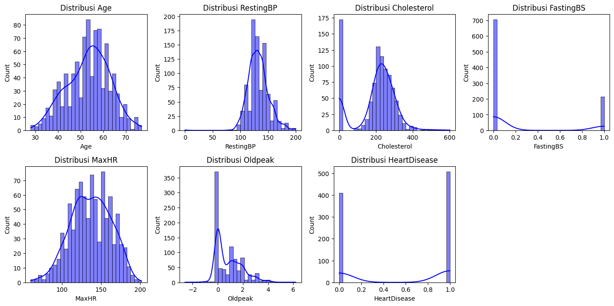
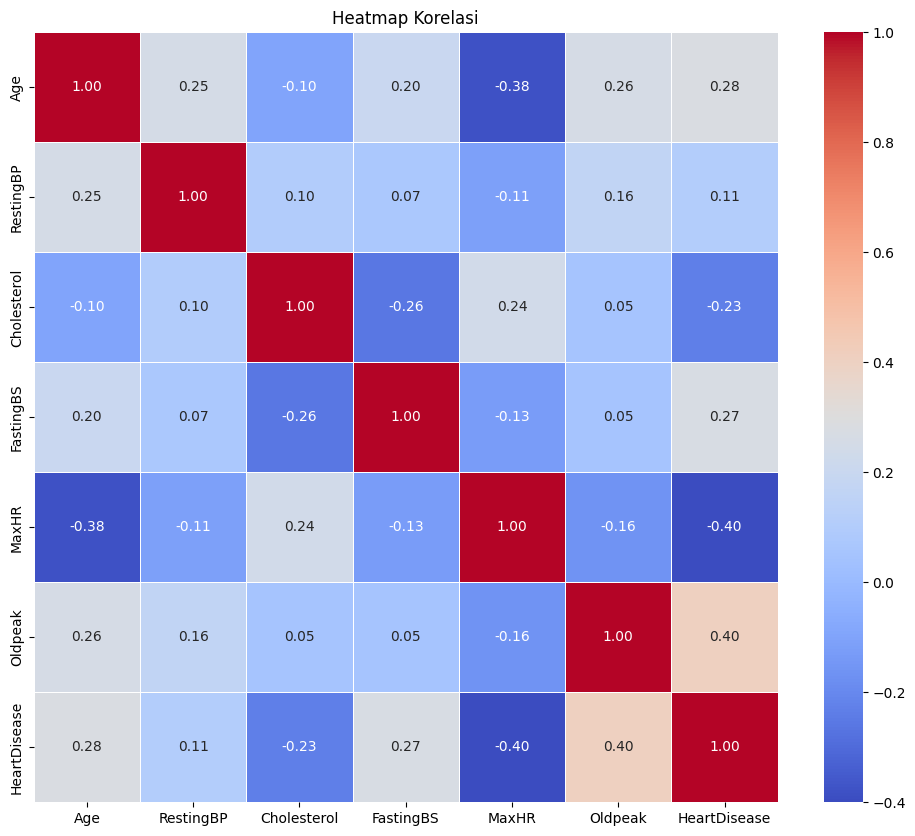
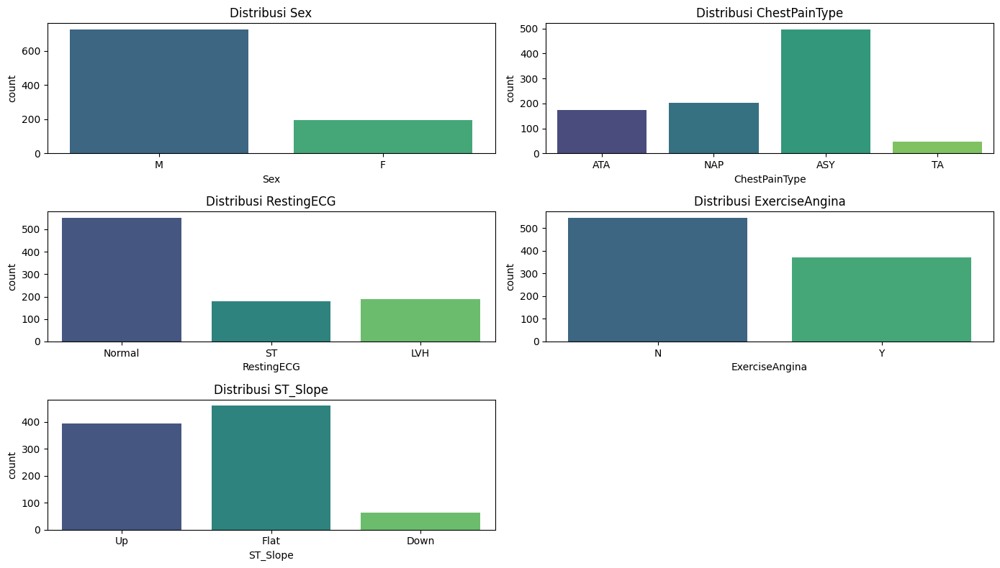
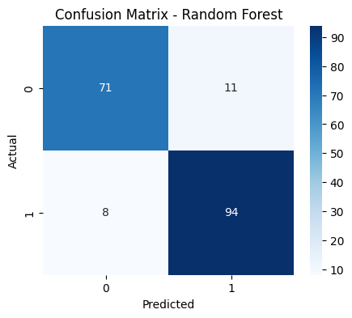
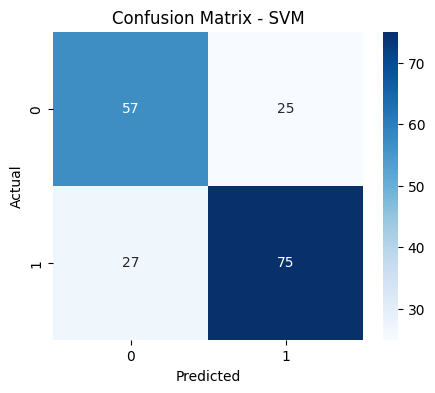

# Laporan Proyek Machine Learning - Ichwan Akmaluddin

## Domain Proyek

Gagal jantung merupakan sebuah kondisi yang diakibatkan karena adanya gangguan pada fungsi jantung, baik secara struktural maupun fungsional. Penyebab  awal  gagal  jantung  kongestif  adalah adanya gangguan pada dinding-dinding otot  jantung  yang  melemah  yang  berdampak  pada  kegagalan  jantung  dalam  memompa  dan  mencukupi  pasokan  darah  yang  dibutuhkan  oleh   tubuh (Prahasti dan Fauzi, 2021). WHO mengatakan bahwa  penyakit kardiovaskular menjadi penyakit mematikan nomor 1 di dunia, yang sekarang juga tercatat sebanyak 17,9 juta kematian terjadi setiap tahunnya. Gagal jantung juga menjadi penyebab kematian pasien penyakit jantung sebanyak 85%. Dalam dunia medis, deteksi dini terhadap pasien yang berisiko tinggi mengalami kematian akibat gagal jantung sangat penting untuk meningkatkan peluang hidup pasien (Febby, F., dkk, 2023). Dengan semakin berkembangnya teknologi, terutama kecerdasan buatan dan machine learning, kini memungkinkan untuk menganalisis data pasien dan memprediksi kemungkinan terjadinya kejadian fatal, seperti kematian, berdasarkan data medis historis pasien tersebut. Prediksi ini dapat membantu dokter dalam mengambil keputusan klinis yang lebih cepat dan tepat.

Berdasarkan kasus yang ada, penanganan yang cepat dan sejak dini dibutuhkan dalam rangka mengurangi lonjakan kasus yang sama oleh gagal jantung setiap tahunnya. Dengan adanya model yang bisa memprediksi ini bisa diharapkan pemeriksaan dini dapat dilakukan dan penanganan yang lebih cepat dan dipersonalkan bagi pasien dengan resiko yang terlihat pasti. Menurut Farida dan Bahri (2024), SVM mampu memperoleh hasil akurasi yang lebih tinggi dibandingkan dengan metode lain. Maka dari itu di sini akan dibandingkan SVM dengan model lain, yaitu metode Random Forest.

## Business Understanding

### Problem Statements
- Seberapa cocok fitur yang digunakan dalam mendeteksi penyakit gagal jantung sebagai pendeteksian sejak dini?

- Bagaimana cara memproses dataset agar bisa digunakan untuk pembuatan model dalam klasifikasi penyakit gagal jantung dengan menggunakan machine learning?

- Apa model machine learning yang cocok untuk membuat sistem klasifikasi gagal jantung?

### Goals

- Mengembangkan model prediksi risiko kematian pasien gagal jantung dengan membangun model klasifikasi berbasis machine learning dengan akurasi yang diharapkan bisa ≥ 85% untuk memprediksi apakah seorang pasien memiliki risiko kematian. Dengan ini akan dilakukan apakah fitur-fitur yang digunakan sudah bisa memenuhi kriteria. Setelah bisa melewati batas minimum akurasi, maka model ini bisa dikatakan model yang bagus.

- Melakukan langkah preprocessing terlebih dahulu seperti data cleaning dan mengkonversinya agar bisa digunakan dalam membuat permodelan machine learning. Dengan cara ini setelah data lebih bersih akan bisa dilakukan pembagian data untuk test dan train untuk permodelan yang selanjutnya bisa dilakukan evaluasi bagaimana matriknya terlihat dan sesuai dengan akurasi yang diharapkan.

- Membandingkan performa dua algoritma machine learning (SVM dan Random Forest) dalam memprediksi risiko gagal jantung berdasarkan metrik evaluasi tertentu. Perbandingan ini akan menentukan apa yang lebih baik dari kedua algoritma yang digunakan dengan data yang sama maka akan dibuat model dengan kedua algoritma yang akan mengahasilkan persentasi akurasi yang sesuai.

### Solution statements
- Dalam mencari hasil yang baik, akan digunakan 2 jenis algoritma dengan melihat akurasi mana yang lebih baik digunakan dan memungkinkan di atas 85%.

- Melakukan evaluasi dengan metrik, melihat hasil dari accuracy, precision, recall dan F1 score yang dihasilkan dari kedua algoritma.

## Data Understanding
Dataset yang digunakan pada projek Machine Learning ini menggunankan dataset dari Kaggle berikut, [Heart Failure Prediction Dataset](https://www.kaggle.com/datasets/fedesoriano/heart-failure-prediction). Dalam dataset ini terdapat sebanyak **918 baris** dan **12 kolom** yang bisa digunakan. Isinya menyebutkan banyak variabel yang sangat cocok digunakan untuk membuat sistem klasifikasi gagal jantung dengan penjelasan variabel akan dijelakan di bagian berikut.

### Variabel-variabel pada Heart Failure Prediction Dataset adalah sebagai berikut:
- ```Age```: Umur pasien dalam tahun.
- ```Sex```: Gender pasien.
- ```ChestPainType```: Tipe nyeri dada yang dialami pasien [TA (Typical Angina): Nyeri dada khas akibat penyempitan pembuluh darah jantung, ATA (Atypical Angina): Nyeri dada tidak khas, bisa berasal dari penyebab lain, NAP (Non-Anginal Pain): Nyeri dada bukan akibat masalah jantung, ASY (Asymptomatic): Tidak menunjukkan gejala nyeri dada sama sekali]
- ```RestingBP```: Tekanan darah saat istirahat dalam ukuran [mm Hg]
- ```Cholesterol```: Kadar kolesterol serum dalam [mm/dl]
- ```FastingBS```: Kadar gula saat puasa [1 jika gula darah > 120 mg/dl (tinggi), 0 jika gula darah ≤ 120 mg/dl (normal)]
- ```RestingECG```: Hasil elektrokardiogram saat istirahat [Normal: Normal, ST: Terdapat kelainan gelombang ST-T (misal elevasi atau depresi ST > 0.05 mV), LVH: Terdapat pembesaran otot ventrikel kiri (hipertrofi ventrikel kiri), berdasarkan kriteria Estes.]
- ```MaxHR```: Detak jantung maksimum [Numeric value antara 60 dan 202]
- ```ExerciseAngina```: Apakah pasien mengalami nyeri dada saat latihan [Y: Yes, N: No]
- ```Oldpeak```: oldpeak = ST [Numeric value saat iskemia atau kekurangan oksigen di jantung saat stres.]
- ```ST_Slope```: Menunjukkan arah kemiringan segmen ST saat puncak aktivitas fisik [Up: kondisi normal atau baik, Flat: bisa menunjukkan masalah jantung, Down: sering dikaitkan dengan risiko tinggi penyakit jantung]
- ```HeartDisease```: Label target untuk klasifikasi [1: heart disease, 0: Normal]

### Visualisasi Data
Berikut ini merupakan Visualisasi data yang telah dilakukan sesuai kategorik dan numerik:

  
  <div align="center">Gambar 1.1 - Visualisasi Penyebaran data numerik</div>

Dari ```Gambar 1.1``` dapat dilihat bahwa semua penyebaran tiap data sangat merata, pada kolom hasil atau ```kolom HeartDisease``` hanya ada 2 kelas dan kelas dengan nilai 1 atau yang menjadi ukur bahwa pasien terkena gagal jantung lebih banyak dibandingkan dengan yang tidak. Selain dari itu ada juga distribusi lainnya dari gambar tersebut yang menunjukan data paling banyak adalah 0, seperti data pada ```cholesterol```,```fastingBS``` dan kolom ```oldPeak``` yang berarti nilainya normal dan pasien tidak ada tanda-tanda pada gejala dari data tersebut.

Pada kolom numerik ini juga memiliki fungsi yang saling berkoleraasi yang ditunjukan pada Heatmap di bawah ini.

  
  <div align="center">Gambar 1.2 - Korelasi antar nilai numerik</div>

Dari Heatmap yang terlihat ada parameter yang menjelaskan seberapa besar korelasi yang ada pada tiap kolom, dan kebanyakan data memiliki korelasi yang tidak begitu kuat korelasinya, namun jika dilihat lagi bahwa korelasi pada data ```heartDisease``` memiliki korelasi yang lebih kuat ke data-data lainnya, terutama dengan data ```oldPeak``` sampai dengan nilai 0.40 yang juga bisa dilihat lebih merah dibandingkan yang lain (selain dari hubungan antar data yang sama).

Selain daripada data numerik, ada juga visualisasi untuk data kategorik seperti gambar di bawah.

  
  <div align="center">Gambar 1.3 - Visualisasi penyebaran data kategorik</div>

Dari visualisasi ini, untuk gender pada pasien terlihat paling banyak adalah *pasien lelaki*, chestPainType terlihat paling banyak adalah ASY atau tidak menunjukkan gejala nyeri dada sama sekali, RestingECG kebanyakan datanya adalah normal, ExerciseAngina juga terlihat banyak pada kelas N yang artinya pada tidak ada nyeri pada pasien saat melakukan latihan. Terakhir juga pada ST_Slope terlihat paling banyak pada flat yang artinya  bisa jadi ada masalah pada jantung.

## Data Preparation
Sebelum mengolah data, maka data yang akan digunakan akan dilakukan terlebih dahulu dengan cara membersihkan data yang kosong, terlihat seperti anomali, data yang terduplikat dan juga sampai dengan melakukan persiapan data menjadi data numerik agar komputer bisa memahami bahasa yang digunakan. Untuk urutan proses yang akan dilakukan pada projek kali ini yaitu melakukan pengecekan missing value, mengecek data yang terduplikat, mengahapus atau mengubah data yang terlihat anomali dan melakukan konversi data. Semua proses ini bertujuan agar bisa meningkatkan akurasi data dan tidak terjadinya underfitting atau overfitting.

### Missing Value

Hal ini perlu dilakukan supaya saat melakukan permodelan tidak mempengaruhi hasil akurasi menjadi rendah. Untuk melihat data apakah ada data yang kosong kita bisa melakukan cara berikut.

```
df.info()
```
Output yang dihasilkan:
```
<class 'pandas.core.frame.DataFrame'>
RangeIndex: 918 entries, 0 to 917
Data columns (total 12 columns):
#   Column          Non-Null Count  Dtype  
---  ------          --------------  -----  
0   Age             918 non-null    int64  
1   Sex             918 non-null    object 
2   ChestPainType   918 non-null    object 
3   RestingBP       918 non-null    int64  
4   Cholesterol     918 non-null    int64  
5   FastingBS       918 non-null    int64  
6   RestingECG      918 non-null    object 
7   MaxHR           918 non-null    int64  
8   ExerciseAngina  918 non-null    object 
9   Oldpeak         918 non-null    float64
10  ST_Slope        918 non-null    object 
11  HeartDisease    918 non-null    int64  
dtypes: float64(1), int64(6), object(5)
memory usage: 86.2+ KB
```

Dari code input di atas dapat melihat jumlah data secara lengkap, kemudian untuk nilai pastinya apakah ada yang hilang atau tidak, kita bisa menjalankan code seperti di bawah ini.
```
print("\nMissing values per fitur:")
print(df.isnull().sum())
```

Output yang dihasilkan:
```
Missing values per fitur:
Age               0
Sex               0
ChestPainType     0
RestingBP         0
Cholesterol       0
FastingBS         0
RestingECG        0
MaxHR             0
ExerciseAngina    0
Oldpeak           0
ST_Slope          0
HeartDisease      0
dtype: int64
```

### Data Anomali
Setelah mengecek missing value, kita bisa melihat data yang tersedia, apakah semua data memiliki nilai yang normal? untuk itu salah satu caranya adalah dengan melakukan pengecekan data dengan visualisasi data atau juga bisa dengan code berikut ini.
```
df.describe()
```

Outputnya yaitu:
```

         Age	      RestingBP	    Cholesterol   FastingBS	  MaxHR	        Oldpeak	      HeartDisease
count	 918.000000	  918.000000	918.000000    918.000000  918.000000	918.000000	  918.000000
mean	 53.510893	  132.396514	198.799564	  0.233115	  136.809368	0.887364	  0.553377
std	     9.432617	  18.514154	    109.384145	  0.423046	  25.460334	    1.066570	  0.497414
min	     28.000000	  0.000000	    0.000000	  0.000000	  60.000000	    -2.600000	  0.000000
25%	     47.000000	  120.000000	173.250000    0.000000	  120.000000	0.000000	  0.000000
50%	     54.000000	  130.000000	223.000000	  0.000000	  138.000000	0.600000	  1.000000
75%	     60.000000	  140.000000	267.000000	  0.000000	  156.000000	1.500000	  1.000000
max	     77.000000	  200.000000	603.000000	  1.000000	  202.000000	6.200000	  1.000000

```
Untuk output yang dihasilkan bisa dilihat pada oldpeak terlihat nilai minimalnya yang kurang dari 0, oleh karena ini akan dilakukan penyesuaian data dengan mengubah data menjadi 0 daripada harus menghapus data yang ada. Untuk cara yang dilakuakn yaitu sebagai berikut.

```
df['Oldpeak'] = df['Oldpeak'].apply(lambda x: 0 if x < 0 else x)
```
Dengan begitu makan nilai pada oldpeak yang berada di bawah 0 akan berubah menjadi nilai minimal 0.

### Cek data duplikat
Untuk melakukan cek apakah ada data yang terduplikat dapat dilakukan cara sebagai berikut.
```
df.duplicated().sum()
```
Dengan ini pada projek kali ini dihasilkan output hanya berupa ```0``` saja yang artinya tidak ada data yang terduplikat pada dataset ini.

### Konversi data
Untuk komputer bisa lebih mudah dalam memahami bahasa manusia, maka bahasa ini akan diproses ke bahasa komputer telebih dahulu agar bisa lebih mudah dipahami komputer, untuk caranya sendiri di sini akan menggunakan teknik one-shot encoding dengan menjadikannya nilai integer. untuk prosesnya akan seperti berikut.

```
df_encoded = pd.get_dummies(df, columns=['Sex', 'ChestPainType', 'RestingECG', 'ExerciseAngina', 'ST_Slope'], dtype=int)
```
prose ini kan melibatkan kolom-kolom yang masih berupa huruf dan mengubahnya menjadi angka, pada tiap kelas di kolom akan 1 kolom baru sehingga akan menghasilan banyak kolom baru jika kelasnya ada lebih dari 2 kelas.

## Modeling
Pada tahap ini, saya menggunakan dua algoritma machine learning, yaitu Random Forest Classifier dan Support Vector Machine (SVM) untuk menyelesaikan masalah klasifikasi penyakit jantung.

### Tahapan dan Parameter yang Digunakan:
- Data dibagi menjadi data *training* dan *testing* dengan rasio 80:20 menggunakan fungsi ```train_test_split``` dari Scikit-learn dengan parameter ```random_state=42``` dan ```stratify=y``` agar distribusi kelas seimbang di kedua subset. Berikut ini merupakan cara melakukan pembagian data.
```
X_train, X_test, y_train, y_test = train_test_split(X, y, test_size=0.2, random_state=42, stratify=y)
```
- Random Forest Classifier dilatih dengan parameter ```n_estimators=100``` dan ```random_state=42```.
- SVM menggunakan ```kernel rbf```, parameter ```C=1.0```, ```gamma='scale'```, dan ```random_state=42```.

Dari kedua parameter yang digunakan dari masing-masing pelatihan, dibuatlah code sebagai berikut.
```
rf = RandomForestClassifier(n_estimators=100, random_state=42)
rf.fit(X_train, y_train)

svm = SVC(kernel='rbf', C=1.0, gamma='scale', random_state=42)
svm.fit(X_train, y_train)
```

### Model algoritma yang digunakan:
**Random Forest:**

Random Forest bekerja dengan membangun banyak decision tree secara acak dari subset data dan fitur yang berbeda. Setiap pohon memberikan hasil prediksinya, dan Random Forest akan menggabungkan hasil dari semua pohon tersebut melalui proses voting. Dengan cara ini, model menjadi lebih kuat dan stabil karena mengurangi risiko overfitting yang biasa terjadi pada decision tree tunggal.

- **Kelebihan**: Stabil terhadap noise, mampu menangani data yang tidak linear, dan memberikan fitur penting.
- **Kekurangan**: Cenderung lebih lambat saat prediksi dibanding model yang lebih sederhana.

**SVM:**

Support Vector Machine (SVM) bekerja dengan mencari sebuah garis pemisah atau hyperplane yang memaksimalkan jarak (margin) antara dua kelas data. Titik data yang paling dekat dengan garis pemisah disebut support vectors. Jika data tidak dapat dipisahkan secara linear, SVM akan menggunakan fungsi kernel, seperti Radial Basis Function (RBF), untuk memetakan data ke ruang berdimensi lebih tinggi agar menjadi dapat dipisahkan. Dengan demikian, SVM sangat efektif untuk menangani data dengan pola yang kompleks dan dimensi tinggi.

- **Kelebihan**: Sangat efektif di ruang dimensi tinggi dan ketika jumlah fitur lebih banyak dari sampel.
- **Kekurangan**: Kurang efisien untuk dataset besar dan membutuhkan penyesuaian kernel serta parameter.

**Pemilihan Model Terbaik:**

Setelah melatih kedua model dan melihat hasil evaluasi dari  data testing,  model dengan performa terbaik akan dipilih sebagai solusi akhir dan pada kasus kali ini random forest memiliki persentase akurasi yang lebih tinggi dibandingkan dengan algoritma svm.

## Evaluation
Dalam projek klasifikasi potensi gagal jantung kali ini, ada beberapa matrik evaluasi yang dijalankan sebagai berikut:
1. Accuracy (Akurasi): Mengukur hasil kebenaran model yang telah dibuat. Hal ini akan memengaruhi seberapa baik model machine learning yang dibuat, sehingga nilai yang mendekaati nilai 100 maka akan semakin akurat sebuah machine learning memprediksi nilai dengan benar.
2. Precision (Presisi): Melihat seberapa besar nilai dari true positif, yang artinya melihat apakah nilai dari kelas itu banyak memprediksi hasil dengan bener atau masih ada prediksi dari False negatif yang dianggap benar. Semakin tinggi nilainya maka kesalahan memprediksi apakah pasien bisa terkena gagal jantung atau tidak bisa semakin akurat.
3. Recall (Sensitivitas): Melihat hasil positif yang ada, kemudian dilihat seberapa banyak nilai positif yang bernilai salah.
4. F1 Score: Di sini akan dilihat keseimbangan antara precision dan recall, jika nilainya tidak seimbang maka model jiga tidak baik. Jika nilai precision lebih tinggi maka bisa saja positif yang sebenarnya tidak terdeteksi. Sementara, jika nilai recall terlalu tinggi dibandingkan precision maka bisa saja banyak yang bernilai positif tetapi bisa bernilai salah.

Dari hasil perbandingan evaluasi pada kedua model dapat dilihat sebagai berikut:

| Model                   | Akurasi  | Presisi | Recall   | F1-Score |
|-------------------------|----------|---------|----------|----------|
| Random Forest           | 89,67%   | 89,68%  | 89,67%   | 89,65%   |
| SVM                     | 71,74%   | 71,82%  | 71,74%   | 71,77%   |

Dilihat dari kedua model yang telah dibuat, kedua sama-sama memiliki keseimbangan dilihat dari nilai f1-score nya, tetapi untuk ketepatan data maka model dengan algoritma Random Forest terlihat lebih baik dalam keakuratan dalam menghasilkan output yang lebih baik.

| Confusion Matrix Random Forest | Confusion Matrix SVM |
|----------|----------|
|  |  |


Dari foto yang ada pada tabel bisa dilihat jika:
- Hasil prediksi nilai 0 yang bernilai True pada model random forest sebesar 71 sedangkan pada model SVM sebesar 57.
- Hasil nilai 0 yang bernilai False pada model random forest sebesar 11 sedangkan pada model SVM sebesar 25.
- Hasil nilai 1 yang bernilai False pada model random forest sebesar 8 sedangkan pada model SVM sebesar 27.
- Hasil nilai 1 yang bernilai True pada model random forest sebesar 94 sedangkan pada model SVM sebesar 75.


Dari hasil yang sudah dilakukan sejauh ini bisa dilihat model dengan algoritma Random Forest lebih cocok untuk kasus kali ini karena menghasilkan akurasi yang sangat baik dibandingkan dengan menggunakan algoritma SVM.

### Daftar Pustaka

1. Prahasti, S. D., & Fauzi, L. (2021). Risiko Kematian Pasien Gagal Jantung Kongestif (GJK). Indonesian Journal of Public Health and Nutrition, 1(3), 388-395.
2. Febby, F., Arjuna, A., & Maryana, M. (2023). Dukungan Keluarga Berhubungan dengan Kualitas Hidup Pasien Gagal Jantung. J Penelit Perawat Prof, 5(2), 691-702.
3. Farida, L. N., & Bahri, S. (2024). Klasifikasi Gagal Jantung menggunakan Metode SVM (Support Vector Machine). Komputika: Jurnal Sistem Komputer, 13(2), 149-156.